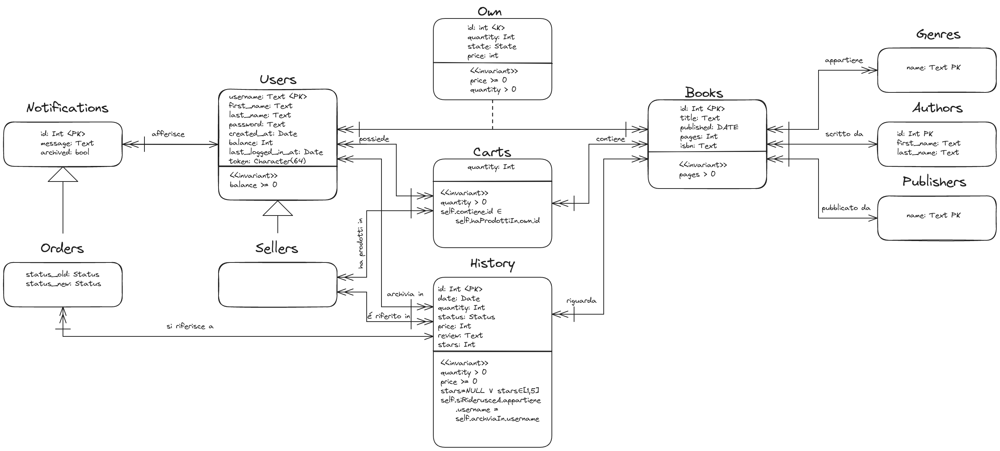

# Tabella dei Contenuti
1. [Introduzione](#introduzione)
2. [Funzionalità Principali](#funzionalità-principali)
    1. [Sistema di Autenticazione](#sistema-di-autenticazione)
    2. [Visualizzazione singolo Libro e relative Inserzioni](#visualizzazione-singolo-libro-e-relative-inserzioni)
    3. [Gestione del Carrello](#gestione-del-carrello)
    4. [Visualizzazione degli Acquisti](#visualizzazione-degli-acquisti)
    5. [Struttura delle Pagine](#struttura-delle-pagine)
    6. [Gestione delle Inserzioni](#gestione-delle-inserzioni)
    7. [Visualizzazione della propria Libreria](#visualizzazione-della-propria-libreria)
    8. [Visualizzazione delle Notifiche](#visualizzazione-delle-notifiche)
    9. [Gestione degli Ordini](#gestione-degli-ordini)
    10. [Gestione del Profilo](#gestione-del-profilo)
    11. [Gestione della Ricerca](#gestione-della-ricerca)
    12. [Visualizzazione Venditore](#visualizzazione-venditore)
3. [Progettazione Concettuale e Logica](#progettazione-concettuale-e-logica)
    1. [Entità](#entità)
        1. [Entità `Users`](#entità-users)
        2. [Entità `Sellers`](#entità-sellers)
        3. [Entità `Carts`](#entità-carts)
        4. [Entità `History`](#entità-history)
        5. [Entità `Books`](#entità-books)
        6. [Entità `Genres`](#entità-genres)
        7. [Entità `Authors`](#entità-authors)
        8. [Entità `Publishers`](#entità-publishers)
        9. [Entità `Notifications`](#entità-notifications)
        10. [Entità `Orders`](#entità-orders)
    2. [Relazioni](#relazioni)
        1. [Relazione `afferisce`](#relazione-afferisce)
        2. [Relazione `own`](#relazione-own)
        3. [Relazione `appartiene`](#relazione-appartiene)
        4. [Relazione `scritto da`](#relazione-scritto-da)
        5. [Relazione `pubblicato da`](#relazione-pubblicato-da)
        6. [Relazione `contiene`](#relazione-contiene)
        7. [Relazione `possiede`](#relazione-possiede)
        8. [Relazione `riguarda`](#relazione-riguarda)
        9. [Relazione `ha prodotti in`](#relazione-ha-prodotti-in)
        10. [Relazione `é riferito in`](#relazione-é-riferito-in)
        11. [Relazione `si riferisce a`](#relazione-si-riferisce-a)
    3. [Schema ER Risultante](#schema-er-risultante)
    4. [Rappresentazione Logica](#rappresentazione-logica)
        1. [Tabella `genres`](#tabella-genres)
        2. [Tabella `authors`](#tabella-authors)
        3. [Tabella `publishers`](#tabella-publishers)
        4. [Tabella `books`](#tabella-books)
        5. [Tabella `booksgenres`](#tabella-booksgenres)
        6. [Tabella `users`](#tabella-users)
        7. [Tabella `owns`](#tabella-owns)
        8. [Tabella `carts`](#tabella-carts)
        9. [Tabella `history`](#tabella-history)
        10. [Tabella `notifications`](#tabella-notifications)
4. [Query Interessanti](#query-interessanti)
    1. [Query 1](#query-1)
    2. [Query 2](#query-2)
    3. [Query 3](#query-3)
    4. [Query 4](#query-4)
    5. [Query 5](#query-5)
5. [Scelte Progettuali](#scelte-progettuali)
    1. [Trigger](#trigger)
        1. [Trigger `check_quantity_zero_trigger`](#trigger-check_quantity_zero_trigger)
        2. [Trigger `trigger_status_change`](#trigger-trigger_status_change)
        3. [Trigger `trigger_notifications`](#trigger-trigger_notifications)
        4. [Trigger `trigger_user_rating`](#trigger-trigger_user_rating)
        5. [Trigger `trigger_carts_owner`](#trigger-trigger_carts_owner)
        6. [Trigger `trigger_history_notifications`](#trigger-trigger_notifications)
        7. [Trigger `trigger_carts_selling`](#trigger-trigger_carts_selling)
    2. [View Materializzate](#view-materializzate)
        1. [Vista `notifications_count`](#vista-notifications_count)
        2. [Vista `star_count`](#vista-star_count)
    3. [Indici](#indici)
        1. [Indice `idx_title_books`](#indice-idx_title_books)
        2. [Indice `idx_isbn_books`](#indice-idx_isbn_books)
        3. [Indice `idx_author_books`](#indice-idx_author_books)
        4. [Indice `idx_publisher_books`](#indice-idx_publisher_books)
        5. [Indice `idx_token_users`](#indice-idx_token_users)
        6. [Indice `idx_own`](#indice-idx_own)
        7. [Indice `idx_history`](#indice-idx_history)
        8. [Indice `idx_seller_history`](#indice-idx_seller_history)
        9. [Indice `idx_buyer_history`](#indice-idx_buyer_history)
        10. [Indice `idx_username_notifications`](#indice-idx_username_notifications)
        11. [Indice `idx_username_notifications_count`](#indice-idx_username_notifications_count)
        12. [Indice `idx_seller_star_count`](#indice-idx_seller_star_count)
    4. [Controlli Ulteriori](#controlli-ulteriori)
        1. [Validazione degli Input](#validazione-degli-input)
        2. [Utilizzo dell'ORM](#utilizzo-dellorm)
        3. [Utilizzo di Trigger e Check](#utilizzo-di-trigger-e-check)
        4. [Autenticazione e Validazione](#autenticazione-e-validazione)
        5. [Utente e Database dedicati](#utente-e-database-dedicati)
6. [Ulteriori informazioni](#ulteriori-informazioni)
    1. [Libreria `MyPy`](#libreria-mypy)
    2. [Libreria `python-dotenv`](#libreria-python-dotenv)
    3. [Componenti Riutilizzabili](#componenti-riutilizzabili)
    4. [Libreria `wtform`](#libreria-wtform)
    5. [Libreria `bcrypt`](#libreria-bcrypt)
    6. [Libreria `session`](#libreria-session)
7. [Contributo al Progetto](#contributo-al-progetto)


# Introduzione
La variante del progetto da noi scelta è quella dell'"e-commerce", che abbiamo personalizzato come una piattaforma specializzata nella vendita di libri. Questa piattaforma supporta la ricerca delle singole opere, affinabile tramite filtri, e la conseguente acquisto da parte degli utenti registrati. Ogni utente può successivamente decidere di vendere i propri libri al prezzo desiderato e, se l'opera non è ancora presente nel database, può aggiungerla fornendo i relativi metadata, come il genere, l'autore, la copertina, ecc.


# Funzionalità principali
Le funzionalità pricipali che abbiamo implementato sono le seguenti:

## Sistema di Autenticazione
(auth.py)
Il sistema di autenticazione implementato si occupa di gestire le registrazioni, i login, i logout e la validazione dei token di sessione.

I login sono gestiti come segue: l'utente invia tramite l'apposito form utente e password, si recupera l'oggetto corrispondente allo username dato. Se un utente è stato trovato, allora si controlla la password sfruttando la funzione `check_password_hash` fornita da `bcrypt`, e se il controllo passa si genera un nuovo token tramite la funzione `getNewToken()`, la quale invoca `secrets.token_hex(tokenSize)` per ottenere una stringa randomica esadecimale che verrà assegnata ad un cookie (`session["token"]`) usando la libreria session

Le registrazioni sono gestite come segue: si controlla che tutti i parametri siano stati passati e non siano `None`, si procede controllando che il nome utente contenga solo lettere o numeri, che il nome e il cognome contengano solo lettere e che le password passate corrispondano. Una volta fatto questo si interroga il database per trovare un'altro eventuale utente, se non esiste si procede all'inserzione del nuovo utente a cui si assegna anche un token si sessione generato al momento

Il logout funziona andando a trovare l'utente con un dato token si sessione all'interno del database, per poi andarlo a porre a `NULL`. Viene sempre e comunque rimosso il token di sessione, ma solo se il token è stato cancellato anche a lato database viene mostrato il messaggio di successo.

Nel caso in avvenga un errore con il token csrf, ovvero un valore randomico univoco per la richiesta fatta in fase di registrazione, allora viene mostrata una pagina d'errore (cosa che non dovrebbe mai accadere se non, ad esempio, in caso di attacchi MITM)

Le funzioni `checkLoggedIn` e `getLoggedInUser` funzionano essenzialmente alla stessa maniera: entrambe prendono il token di sessione e lo cercano sul database per recuperare l'utente corrispondente, controllano che sia ancora valido (durata di 1 giorno) e ritornano di conseguenza `True` o l'oggetto corrispondente di tipo `User` in caso di successo, `False` o `None` altrimenti.

## Visualizzazione singolo Libro e relative Inserzioni
(book.py)


## Gestione del Carrello
(cart.py)


## Visualizzazione degli Acquisti
(history.py)
Lo storico, una volta controllato che l'utente sia loggato e ricevuti l'id dell'acquisto fatto (id nello storico), una recensione e una valutazione, procedono a controllare che i dati passati siano validi (quindi non `None` e con una recensione almeno lunga 2 caratteri), procedono a modificare l'oggetto `History` corrispondente al prodotto nello storico andando ad aggiungere la recensione e la valutazione. In caso di errori viene eseguito un rollback esplicitamente e viene mostrato un messaggio d'errore. Infine vengono ricaricati gli oggetti aggiornati presenti nello storico con lo scopo di visualizzarli


## Struttura delle Pagine
(index.py)


## Gestione delle Inserzioni
(inserionmanager.py)
Il sistema di gestione delle inserzioni di occupa di ricevere alcune informazioni come l'id del libro, il suo stato ecc... e di apportare le modifiche rischieste dall'utente tramite i form ad esso forniti.

Le operazioni che un utente può svolgere sono:
- creazione di un'inserzione
- aggiornamento di un'inserzione
- eliminazione di un'inserzione
Ognuna di queste operazioni ha una funzione che si occupa di controllare che una serie di dati necessari (es. per creare un'inserzione è necessario conoscere l'id e lo stato del libro che si vuole cendere), per poi ritornare il form in cui vengono richieste le informazioni mancanti (es. sempre per l'inserzione, la quantità di libri da vendere e il relativo prezzo)

Le singole operazioni effettive gestite tramite richieste `POST` sono poi elaborate da funzioni differenti:
- Aggiornamento Inserzione

    l'operazione di aggiornamento di un'inserzione inzia controllando che l'utente sia un venditore abilitato, per poi appoggiarsi alla funzione `retriveExistingBooks` al fine di recuperare i libri con lo stesso id che sono in vendita o meno. Una volta controllato che ci siano sufficienti libri a cui apportare la modifica, la si applica al record esistente, oppure se ne crea uno nuovo. In caso di errori avviene un rollback. Questa operazione, quindi, permette solamente di aggiornare i prezzi e non di rimuovere libri dalla vendita
- Creazione Inserzione

    una volta controllato che l'utente sia un venditore, si recuperano i libri sia in vendita che quelli che non lo sono tramite la funzione `retriveBooks`, e se la quantità di libri è sufficiente viene chiamata la funzione `manageInsertion` abilitando l'aggiunta tramite l'ultimo parametro impostato a `true`
- Eliminazione Inserzione

    l'operazione di eliminazione controlla che l'utente sia un venditore, recupera i libri tramite l'operazione `retriveBooks`, controlla che ci sia quantità sufficiente di libri da rimuovere, in caso affermativo viene chiamata la funzione `manageInsertion` abilitando la rimozione tramite l'ultimo parametro impostato a `False`

La funzione `retriveBooks` si occupa di recuperare i libri in vendita e quelli che non sono in vendita, sopo aver opportunamente controlalto che l'utente abbia passato tutti i parametri corretti tramite il form

La funzione `retriveExistingBooks` compie un'operazione simile a `retriveBooks`, se non per il fatto che opera con libri che sono esclusivamente in vendita

La funzione `manageInsertion` si occupa di gestire tutti i casi in cui l'aggiunta e la rimozione di libri comportino il dover creare, eliminare o aggiornare dei record all'interno della tabella [`owns`](#tabella-owns). In caso di errori, si occupa autonomamente di effettuare un rollback esplicitamente, emtre se va tutto a buon fine effettua un commit


## Visualizzazione della propria Libreria
(library.py)


## Visualizzazione delle Notifiche
(notifications.py)


## Gestione degli Ordini
(orders.py)


## Gestione del Profilo
(profile.py)
La visualizzazione del profilo permette all'utente di modificare alcuni attributi che esso ha, tra cui il nome e il cognome, la password, il proprio saldo (scleta fatta in quanto non abbiamo un vero e proprio modo di aggiungere effettivamente della valuta all'account o gestire delle carte). Viene anche data la possibilità all'utente di effettuare un upgrade al suo account e diventare un venditore.

Le operazioni di aggiornamento avvengono controllando se sono avvenuti dei cambiamenti ai dati pasati al form rispetto a quelli che sono presenti all'interno del database. Una volta che un cambiamento avviene, le modifica vengono validate (es. il nome e il cognome devono contenere solamente lettere, la password deve avere una certa lunghezza, il balance deve essere un numero...) e vengono applicate sull'oggeto `usr`, il quale aggiornerà automaticamente anche il database a seguito del commit presente alla riga successiva. In caso siano presenti degli errori, essi vengono mostrati tutti in una volta sola, senza andare ad applicare modifiche alla base di dati


## Gestione della Ricerca
(search.py)


## Visualizzazione Venditore
(seller.py)


# Progettazione Concettuale e Logica
A seguito della progettazione concettuale abbiamo individuato le seguenti entità:
## Entità
### Entità `Users`
Rappresentano gli utenti che accedono all'e-commerce e hanno i seguenti attributi:
- `username`: Nome utente usato per effettuare il login che gli identifica univocamente
- `first_name` e `last_name`: nome e cognome per dare un grado di personalizzazione all'account in più
- `password`: password già hashata e salata utilizzata nella fase di login per provare l'identità dell'utente
- `created_at`: data di creazione dell'account
- `balance`: quantità di denaro in centesimi che l'utente ha caricato nell'account
- `last_logged_in_at`: data di ultimo login, utilizzata per controllare la validità del token salvato come cookie
- `token`: valore generato randomicamente che viene passato all'utente in fase di registrazione o login, viene utilizzato per autorizzare tutte le operazioni che esso andrà a fare (es. accedere alla propria libreria)

Viene aggiunta un'invariante che controlla che il `balance` dell'account non posso mai andare negativo (la piattaforma non offre, quindi, la possibilità di fare credito all'utente)

### Entità `Sellers`
L'entità specializza utenti, e serve per distinguere quali di essi sono abilitati alla vendita e quali no

### Entità `Carts`
Questa entità rappresenta un a serie di libri uguali che l'utente vuole comprare. Collega quindi l'utente al libro e al realtivo venditore, specificando una data quantità. L'attributo dell'entità è:
- `quantità`: rappresenta la quantità di uno specifico libro che è stato aggiunto al carrello

Vengono specificate tre invarianti: una che controlla che la quantità sia positiva, una che controlla che il libro/i che si vuole comprare faccia parte dei libri appartenenti al venditore e un'ultima che controlla che il libro che si intende acquistare sia effettivamente in vendita

### Entità `History`
L'entità rappresenta lo storico degli acquisti effettuati dall'utente, includendo un campo per lasciare una recensione sull'esperienza d'acquisto e relativa valutazione in stelle. Gli attributi sono i seguenti:

- `id`: identifica lo specifico record nello storico
- `date`: data di quando si è effettuato l'acquisto
- `quantity`: quantità di libri che sono stati acquistati
- `status`: indica stato della spedizione, in modo da informare l'utente sui movimenti del suo acquisto
- `price`: salva il prezzo di acquisto in centesimi
- `review`: campo dedicato alla recensione scritta da parte dell'utente
- `stars`: campo dedicato a lasciare la propria valutazione in stelle

Vengono specificati anche tre invarianti, una che controlla che la quantità acquistata sia maggiore di 0, un'altra che controlla che il prezzo non sia negativo e un'ultima che controlla che le notifiche generate dall'acquisto e conseguenti aggiornamenti di spedizione facciano riferimento all'acquirente corretto

### Entità `Books`
L'entitò rappresenta i libri presenti all'interno del database come "entità" astratta, quindi non il singolo libro posseduto da un certo utente. L'entità ha anche i seguenti campi:

- `id`: identifica il libro univocamente all'interno della base di dati
- `title`: titolo del libro
- `published`: data di pubblicazione del libro
- `pages`: numero di pagine 
- `isbn`: codice isbn del libro

Viene specificata anche un'invariante che controlla che le pagine siano in numero maggiore di $0$

### Entità `Genres`
Entità rappresentante i possibili generi dei libri. Il suo unico attributo è:
- `nome`: nome del genere che lo identifica anche

### Entità `Authors`
Entità rappresentante gli autori dei libri. I suoi attributi sono:
- `id`: id dell'autore che lo identifica
- `first_name`: nome dell'autore
- `last_name`: cognome dell'autore

### Entità `Publishers`
Entità rappresentante una casa pubblicatrice di libri. Il suo unico attributo è:
- `nome`: nome identificativo della casa pubblicatrice

### Entità `Notifications`
Entità rappresentante le singole notifiche di un certo utente. Essa ha i seguenti attributi:
- `id`: identificativo della notifica
- `message`: messaggio della notifica
- `archived`: valore booleano usato per segnare quanto un utente fa l'acknowledge della notifica

### Entità `Orders`
Enità che specializza `Notifications` al fine di contenere maggiori informazioni per gli ordini andando ad agginge 2 attributi:
- `status_old`: vecchio stato della spedizione
- `status_new`: nuovo stato della spedizione

## Relazioni
Di seguito sono riportate le relazioni che abbiamo deciso di implementare nel nostro schema ER

### Relazione `afferisce`
Collega la singola notifica al singolo utente, non ha attributi

### Relazione `own`
Collega l'utente ai libri da esso posseduti e ha i seguenti attributi:
- `quantity`; indica la quantità dello specifico libro posseduta dall'utente
- `state`: indica lo stato fisico del libro
- `price`: se il libro è in vendita, allora il prezzo viene popolato con la quantità di valuta desiderata dall'utente

Vengono aggiunte anche due invarianti che fanno si che la quantità sia sempre maggiore di $0$ e che il prezzo sia positivo o nullo

### Relazione `appartiene`
Collega il libro ai suoi generi

### Relazione `scritto da`
Collega il libro al suo autore

### Relazione `pubblicato da`
Collega il libro alla sua casa pubblicatrice

### Relazione `contiene`
Collega il record del carrello al libro a cui esso si riferisce

### Relazione `possiede`
Collega l'utente al suo carrello, ovvero ai vari record di prodotti che vuole comprare

### Relazione `riguarda`
Collega un record nella cronologia al libro che un'utente ha comprato

### Relazione `ha prodotti in`
Collega il venditore ai prodotti che gli utenti hanno nel loro carrello (sempre considerando il fatto che per ogni prodotto distinto nel carrello c'è un record)

### Relazione `é riferito in`
Collega ogni record nella cronologia al venditore da cui si è comprato un determinato prodotto

### Relazione `si riferisce a`
Collega la notifica specifica notifica di un aggiornamento riguardante un ordine al record presente nello storico degli ordini (es. nel caso il libro venga spedito)

## Schema ER Risultante


## Rappresentazione Logica

### Tabella `genres`
$$
\begin{aligned}
&genres\;(\underline{name}:string) \\
& \qquad PK(name)
\end{aligned}
$$

Rispecchia la sua corrispettiva [entità](#entità-genres), mantenendo come campi:
- `nome` che ha tipo `TEXT` ed è `PRIMARY KEY`

### Tabella `authors`
$$
\begin{aligned}
&authors\;(\underline{id}:int,\; first\_name:string,\; last\_name:string) \\
& \qquad PK(id)
\end{aligned}
$$

Rispecchia la sua corrispettiva [entità](#entità-authors), mantenendo come campi:
- `id` che ha tipo `SERIAL` ed è `PRIMARY KEY`, in modo da evere un modo comodo di gestire le omonimie tramite un contatore autoincrementale
- `first_name` che ha tipo `CHARACTER VARYING(255)`, quindi una stringa di caratteri di dimensione variabile che non può essere `NULL`
- `last_name` che ha le stesse caratteristiche di `first_name` per eguali motivi

### Tabella `publishers`
$$
\begin{aligned}
&publishers\;(\underline{name}:string) \\
& \qquad PK(name)
\end{aligned}
$$

Rispecchia la sua corrispettiva [entità](#entità-publishers), mantenendo come campi:
- `name` che ha tipo `TEXT` ed è `PRIMARY KEY`

### Tabella `books`
$$
\begin{aligned}
&books\;(\underline{id}:int,\; title:string,\; published:date,\; pages:int,\; isbn:string,\; fk\_author:int,\; fk\_publisher:string) \\
& \qquad PK(id) \\
& \qquad fk\_author \;FK\; author(id) \\
& \qquad fk\_publisher \;FK\; publishers(name) 
\end{aligned}
$$

Per quanto rispecchi in parte la sua [entità](#entità-books), questa tabella va anche ad aggiungere agli attributi anche le relazioni qui riportate:
- `id`: identificativo artificiale del libro, motivo per cui è `SERIAL PRIMARY KEY`
- `title`: titolo del libro, quindi è `TEXT NOT NULL`
- `published`: data di pubblicazione, quindi `DATE NOT NULL`
- `pages`: numero di pagine obbligatorio (`INTEGER NOT NULL`), a cui viene integrato il seguente controllo che le obbliga ad essere in numero positivo: `CONSTRAINT pages_gt CHECK (pages > 0)`
- `isbn`: sequenza di caratteri che deve coprire diversi standard, per cui è `CHARACTER VARYING(20)`, e può essere omessa
- `fk_author`: chiave esterna, come richiesto dalla relazione [`scritto da`](#relazione-scritto-da), quindi diventa `REFERENCES authors(id)` e ne mantiene il tipo `INTEGER`
- `fk_publisher`: chiave esterna, come richiesto dalla relazione [`pubblicato da`](#relazione-pubblicato-da), quindi diventa `REFERENCES publishers(name)` e ne mantiene il tipo `TEXT`

### Tabella `booksgenres`
$$
\begin{aligned}
&booksgenres\;(\underline{fk\_idB}:int,\; \underline{fk\_genre}:string) \\
& \qquad PK(fk\_idB,\; fk\_genre) \\
& \qquad fk\_idB \;FK\; books(id) \\
& \qquad fk\_genre \;FK\; genres(name) 
\end{aligned}
$$

Questa tabella rappresenta la relazione [`appartiene`](#relazione-appartiene), che è una `n-n`. Ne consegue che abbia come attributi:
- `fk_idB`: chiave esterna di `books(id)` con tipo `INTEGER` e anche parte della chiave primaria
- `fk_genre`: chiave esterna di `genres(name)` con tipo `TEXT` e anche parte della chiave primaria

### Tabella `users`
$$
\begin{aligned}
&users\;(\underline{username}: int,\; first\_name: string,\; last\_name: string,\; password: string,\; created\_at: timestamp,\; balance: int,\; seller: bool,\; last\_logged\_in\_at: timestamp,\; token: string) \\
&\qquad PK(username)
\end{aligned}
$$

La seguente tabella rispecchia fedelmente la struttura di [`Users`](#entità-users), per cui ha i seguenti attributi:
- `username`: nome utente identificativo, ha quindi tipo `VARCHAR(100)` ed è `PRIMARY KEY`
- `first_name`: nome dell'utente, ha tipo `VARCHAR(255)` e non può essere vuoto (`NOT NULL`)
- `last_name`: cognome dell'utente, ha tipo `VARCHAR(255)` e non può essere vuoto (`NOT NULL`)
- `password`: ha tipo `TEXT`, in modo da poter supportare cambiamenti dell'algoritmo di hashing e salting con dimensioni dell'hash differenti. Ovviamente è `NOT NULL`
- `created_at`: `TIMESTAMP` della creazione, deve essere `NOT NULL`
- `balance`: centesimi presenti all'interno dell'account, per cui è `INTEGER` ed è `NOT NULL`. Essendo che deve essere rispettata l'invariante, viene aggiunto il seguente controllo: `CONSTRAINT balance_ge CHECK (balance >= 0)`
- `seller`: flag che sta ad indicare se l'account è abilitato a vendere prodotti, quindi ha tipo `BOOLEAN` ed è `NOT NULL`
- `last_logged_in_at`: orario in cui è stato fatto l'ultimo login, ha tipo `TIMESTAMP WITHOUT TIME ZONE` in modo da avere un oriario consistente tra tutti gli utenti, per quanto ci sia il server flask di mezzo, ed è `NOT NULL`
- `token`: token di autenticazione generato a tempo di login, ha tipo `CHARACTER(64)[]` e può essere `NULL` (in tal caso non esite un token valido)

### Tabella `owns`
$$
\begin{aligned}
&owns\;(\underline{id}: int,\; fk\_username: string,\; fk\_book: int,\; quantity: int,\; state: state,\; price: int) \\
& \qquad PK(id) \\
& \qquad fk\_username \;FK\; users(username) \\
& \qquad fk\_book \;FK\; books(id) 
\end{aligned}
$$

La tabella segue la struttura della realzione [`own`](#relazione-own), collegandosi a [`Users`](#entità-users) e a [`Books`](#entità-books). Per questo ha i seguenti attributi:
- `id`: identificativo dell'oggetto posseduto (rappresenta il libro/i fisico, non il "modello" astratto presente in [`Books`](#entità-books)). Per questo è `SERIAL` ed è anche `PRIMARY KEY`
- `fk_username`: chiave esterna che si riferisce al possessore del libro/i, per questo è un `VARCHAR(100)`, è `NOT NULL` e si riferisce a `users(username)`
- `fk_book`: chiave esterna del "modello" del libro, per questo ha tipo `INTEGER`, è `NOT NULL` e si riferisce a `books(id)`
- `quantity`: indica la quantità di libri posseduta, è quindi `INTEGER NOT NULL`. Non è presente un `CHECK` in quanto il controllo è eseguito da un [trigger](#trigger-remove_if_quantity_zero) che offre anche altre funzionalità.
- `state`: stato fisico di "usura" dell'oggetto, ha un tipo custom `state` e deve essere `NOT NULL`
- `price`: prezzo in centesimi che l'utente può decidere nel caso volesse vendere il libro, altrimenti è impostato a `NULL`. È quindi `INTEGER` e ha il constraint `price_ge_owns CHECK (price >= 0)`, al fine di evitare di poter mettere prezzi negativi

È presente anche un ulteriore vincolo `UNIQUE(fk_username, fk_book, state, price)`, in modo da prevenire la presenza di più record di libri posseduti dallo stesso utente con lo stesso stato e prezzo

### Tabella `carts`
$$
\begin{aligned}
&carts\;(\underline{fk\_buyer}: string,\; \underline{fk\_own}: int,\; quantity: int) \\
& \qquad PK(fk\_buyer,\; fk\_own) \\
& \qquad fk\_buyer \;FK\; users(username) \\
& \qquad fk\_own \;FK\; owns(id) 
\end{aligned}
$$

La tabella `carts` ricalca l'entità [`Carts`](#entità-carts), aggiungendo le relazioni [`possiede`](#relazione-possiede) e [`ha prodotti in`](#relazione-ha-prodotti-in). Per cui ha i seguenti attributi:
- `fk_buyer`: chiave esterna che si riferisce all'utente compratore, ha quindi tipo `VARCHAR(100)` e fa parte della chiave primaria e referenzia `users(username)`
- `fk_own`: chiave esterna del libro posseduto che l'utente è intenzionato a comprare, ha quindi tipo `INTEGER` e fa parte della chiave primaria e referenzia `owns(id)` andando a specificare `ON DELETE CASCADE`, in modo da rimuovere autoamticamente dal carrello un oggetto che viene esaurito
- `quantity`: quantità di prodotto che l'utente è interessato a comprare, ha tipo `INTEGER`, è `NOT NULL` e ha il constraint `quantity_gt_carts CHECK (quantity > 0)`

### Tabella `history`
$$
\begin{aligned}
&history\;(\underline{id}:int ,\; date: timestamp,\; quantity: int,\; status: status,\; price: int,\; review: string,\; stars: int,\; fk\_buyer: string,\; fk\_seller: string,\; fk\_book: int,\; state: state) \\
& \qquad PK(id) \\
& \qquad fk\_buyer \;FK\; users(username) \\
& \qquad fk\_seller \;FK\; users(username) \\
& \qquad fk\_book \;FK\; books(id) 
\end{aligned}
$$

La tabella `history` segue la struttura dell'entità [`History`](#entità-history), aggiungendo le 
- `id`: identificativo artificiale autoincrement, pre cui è `SERIAL` e `PRIMARY KEY` 
- `date`: data di acquisto, quindi è `TIMESTAMP` ed anche `NOT NULL`
- `quantity`: quantità di prodotti acquistata, quindi è `INTEGER`, `NOT NULL` e possiede il constraint `quantity_gt_history CHECK (quantity > 0)` che fa si che la quantità acquistabile non sia nulla o negativa
- `status`: stato dell'ordine/spedizione, ha tipo custom `status` ed è `NOT NULL`
- `price`: prezzo di acquisto in centesimi, è quindi `INTEGER`, `NOT NULL` e ha il constraint `price_ge_history CHECK (price >= 0)` che fa si che il prezzo sia positivo
- `review`: recensione che l'utente può lasciare (non obligatoriamente e successivamente all'acquisto), ha tipo `TEXT`
- `stars`: valutazione in stelle, ha tipo `INTEGER` e ha `CONSTRAINT stars_btw CHECK (stars IS NULL OR stars BETWEEN 0 AND 5)` che fa si che il numero di stelle sia compreso tra $1$ e $5$
- `fk_buyer`: chiave esterna dell'utente che ha comprato, ha quindi tipo `VARCHAR(100)` e si riferisce a `users(username)`
- `fk_seller`: chiave esterna che si riferisce all'utente venditore, ha quindi tipo `VARCHAR(100)` e si riferisce a `users(username)`
- `fk_book`: chiave esterna che si riferisce al "modello" del libro comprato, ha quindi tipo `INTEGER` e si riferisce a `books(id)`
- `state`: stato di usura del prodotto comprato, ha tipo custom `state`

### Tabella `notifications`
$$
\begin{aligned}
&notifications\;(\underline{id}:int ,\; context:disc\_notif ,\; fk\_username:string ,\; message:string ,\; archived:bool ,\; fk\_history:int ,\; order\_status\_old:status ,\; order\_status\_new:status \; ) \\
& \qquad PK(id) \\
& \qquad fk\_username \;FK\; users(username) \\
& \qquad fk\_history \;FK\; history(id) 
\end{aligned}
$$

Questa tabella è frutto dell'unione di due entità: [`Notifications`](#entità-notifications) e [`Orders`](#entità-orders). Ha i seguenti attributi:
- `id`: identificativo della notifica autoincrement, ha tipo `SERIAL` ed è `PRIMARY KEY`
- `context`: tipo di notifica, ha tipo custom `disc_notif` ed è `NOT NULL`
- `fk_username`: chiave esterna dell'utente a cui è destina ta la notifica, ha quindi tipo `VARCHAR(100)`, è `NOT NULL` e si riferisce a `users(username)`
- `message`: messaggio della notifica, ha tipo `TEXT`
- `archived`: flag usato a seguito della visualizzazione del messaggio, ha tipo `BOOLEAN` ed è `NOT NULL`
- `fk_history`: riferimento all'eventuale ordine che ha subito un aggiornamento, ha tipo `INTEGER` e si riferisce a `history(id)`
- `order_status_old`: ha tipo custom `status` ed indica il vecchio stato dell'ordine nel caso fosse stato aggiornato
- `order_status_new`: ha tipo custom `status` ed indica il nuovo stato dell'ordine nel caso fosse stato aggiornato

# Query Interessanti
Avendo utilizzato il più possibile le features di SQLALchemy, come l'ORM, non abbiamo alcuna query scritta direttamente in SQL, se non per lo script di inizializzazione del database (`db.sql`) e lo script di inserzione dei dati di prova (`insert.sql`). Per questo motivo alcune query verranno convertite da python a SQL.

## Query 1 
La seguente query l'abbiamo usata per creare un tipo di dato custom, al fine di facilitare la scrittura delle tabelle, oltre ad avere anceh il vantaggio della presenza di un controllo automatico dei dati da noi inseriti
```postgresql
CREATE TYPE state AS ENUM ('new', 'as new', 'used');
```

## Query 2
La seguente query è stata presa da `library.py`, e ha il compito di recuperare del database i libri posseduti dall'utente andando limitare il numero di risultati con lo scopo di averne solo un certo numero per pagina, il quale numero determinerà anche l'offset
```python
db.session.scalars(
        sq.select(Own)
        .filter(Own.fk_username == user.username)
        .limit(limit)
        .offset((page - 1) * limit)
    ).all()
```
e può essere tradotta come segue (i valori racchiusi in `_` sono i parametri che verrebbero sostituiti):
```postgresql
SELECT *
FROM owns 
WHERE owns.fk_username = _user.username_
LIMIT _limit_ OFFSET _(page-1)*limit_
```

## Query 3
Questa query è stata presa da `book.py`, e ha lo scopo di recuperare le inserzioni (lo capiamo da `Own.price != None`) per un determinato libro (`Own.fk_book == id`) che non appartengono all'utente (`Own.fk_username != username`)
```python
db.session.query(Own)
        .filter(Own.fk_book == id, Own.price != None, Own.fk_username != username)
        .order_by(Own.fk_username)
        .all()
```
In SQL la query sarebbe stata (i valori racchiusi in `_` sono i parametri che verrebbero sostituiti):
```postgresql
SELECT *
FROM owns 
WHERE owns.fk_book = _book.id_ AND owns.price IS NOT NULL AND owns.fk_username != _username_ ORDER BY owns.fk_username
```

## Query 4
La seguente query è stata estratta da `history.py`, e ha lo scopo di caricare tutti gli acquisti che sono stati effettuati dall'utente loggato (motivo di `History.fk_buyer == usr.username`), andandoli ad ordinare in ordine cronologico decrescente (questo lo si fa tramite l'id facendo `.order_by(History.id.desc()`)
```python
db.session.scalars(
        sq.select(History)
        .where(History.fk_buyer == usr.username)
        .order_by(History.id.desc())
```
La query in linguaggio SQL sarebbe stata (i valori racchiusi in `_` sono i parametri che verrebbero sostituiti):
```postgresql
SELECT *
FROM history 
WHERE history.fk_buyer = _user.username_ ORDER BY _History.id_ DESC
```

## Query 5
La seguente query ha lo scopo di recuperare i libri filtrati secondo diversi criteri:
- titolo (`Book.title.icontains(input.search)`)
- nome dell'autore (`Book.author.has(Author.first_name.icontains(input.search))`)
- cognome dell'autore (`Book.author.has(Author.last_name.icontains(input.search))`)
- casa pubblicatrice (`Book.publisher.has(Publisher.name.icontains(input.search))`)
L'utilizzo dell'`or_` permette il funzionamento simultaneo di tutti i filtri. Il risultato della query verrà, in realtà, successivamente rifinito in base ai filtri ulteriori richiesti dall'utente tramite l'aggiunta di ulteriori `WHERE`. Di seguito un esempio
```python
query = db.session.query(Book).filter(
        or_(
            Book.title.icontains(input.search),
            Book.author.has(Author.first_name.icontains(input.search)),
            Book.author.has(Author.last_name.icontains(input.search)),
            Book.publisher.has(Publisher.name.icontains(input.search)),
        )
    )

    if len(input.genres):
        query = query.filter(Book.genres.any(Genre.name.in_(input.genres)))

    if len(input.publishers):
        query = query.filter(Book.publisher.has(Publisher.name.in_(input.publishers)))

    if input.available or input.min or input.max:
        query = query.join(Own)

        if input.available:
            query = query.filter(Own.price != None)
        if input.min:
            query = query.filter(Own.price >= input.min * 100.0)
        if input.max:
            query = query.filter(Own.price <= input.max * 100.0)

    return query.all()
```
La query in linguaggio SQL sarebbe stata indicativamente (i valori racchiusi in `_` sono i parametri che verrebbero sostituiti):
```postgresql
SELECT *
FROM books 
JOIN owns ON books.id = owns.fk_book 
WHERE ((books.title ILIKE '%%' || _title_ || '%%') 
OR (EXISTS (SELECT 1 FROM authors WHERE authors.id = books.fk_author AND authors.first_name ILIKE '%%' || _first_name_ || '%%')) 
OR (EXISTS (SELECT 1 FROM authors WHERE authors.id = books.fk_author AND authors.last_name ILIKE '%%' || _last_name_ || '%%')) 
OR (EXISTS (SELECT 1 FROM publishers WHERE publishers.name = books.fk_publisher AND publishers.name ILIKE '%%' || _name_ || '%%'))) 
AND (EXISTS (SELECT 1 FROM genres, booksgenres WHERE books.id = booksgenres.fk_idb AND genres.name = booksgenres.fk_genre AND genres.name IN _('genre1', 'genre2')_)) 
AND (EXISTS (SELECT 1 FROM publishers WHERE publishers.name = books.fk_publisher AND publishers.name IN _('publisher1', 'publisher2')_)) 
AND owns.price IS NOT NULL 
AND owns.price <= _price_
```

# Scelte Progettuali
## Trigger 
Al fine di garantire l'integrità della base di dati ed implementare alcune features, sono stati usati i seguenti trigger:

### Trigger `check_quantity_zero_trigger`
Questo è il trigger che, come anticipato, potrebbe essere stato sostituito da un `CHECK`. La scelta di utilizzare un trigger è stata fatta al fine di poter sollevare una specifica eccezzione all'interno della funzione, che viene poi catturata python come se fosse una sorta di "segnale" di un determinato problema avvenuto nell'inserimento. Ovviamente, il rollback avviene automaticamente, in quanto a lato SQL l'eccezione non viene mai esplicitamente catturata
```postgresql
CREATE OR REPLACE FUNCTION remove_if_quantity_zero()
RETURNS TRIGGER AS $$
BEGIN
    IF NEW.quantity < 0 THEN --se la quantità è invalida
        RAISE EXCEPTION 'Quantity must be positive';
    ELSIF NEW.quantity = 0 THEN --se il libro è stato "esaurito"...
        DELETE FROM owns WHERE id = NEW.id; -- ...cancellalo di conseguenza
    END IF;

    RETURN NEW;
END;
$$ LANGUAGE plpgsql;

CREATE TRIGGER check_quantity_zero_trigger
AFTER INSERT OR UPDATE OF quantity ON owns
FOR EACH ROW
EXECUTE FUNCTION remove_if_quantity_zero();
```

### Trigger `trigger_status_change`
Il seguente trigger fa si che a seguito di un cambiamento di stato di un ordine (es. quando questo viene spedito), venga generata automaticamente una notifica lo informi dell'avvenimento
```postgresql
CREATE OR REPLACE FUNCTION notify_status_change()
RETURNS TRIGGER AS $$
BEGIN
    INSERT INTO notifications (fk_username, context, archived, fk_history, order_status_old, order_status_new) -- inserici la notifica
    VALUES (NEW.fk_buyer, 'order updated', FALSE, NEW.id, OLD.status, NEW.status); -- ne dati inserisci lo stato vecchio e quello aggiornato
    RETURN NEW;
END;
$$ LANGUAGE plpgsql;

CREATE TRIGGER trigger_status_change
AFTER UPDATE ON history
FOR EACH ROW
WHEN (OLD.status IS DISTINCT FROM NEW.status) -- previene la creazione automatica di notifiche se 
                                              -- non in caso di cambiamenti di stato
EXECUTE FUNCTION notify_status_change();
```

### Trigger `trigger_notifications`
Il seguente trigger viene utilizzato per aggiornare la vista materializzata [`notifications_count`](#vista-notifications_count) a seguito dell'aggiunta di una nuova notifica. Per questo motivo il trigger che chiama la funzione `notifications_count_refresh` è un `AFTER TRIGGER`
```postgresql
CREATE OR REPLACE FUNCTION notifications_count_refresh()
RETURNS TRIGGER AS $$
BEGIN
    REFRESH MATERIALIZED VIEW notifications_count; -- aggiorna la view materializzata
    RETURN NULL;
END;
$$ LANGUAGE plpgsql;

CREATE TRIGGER trigger_notifications
AFTER INSERT OR UPDATE OR DELETE ON notifications -- a seguito di qualsiasi cambiamento
EXECUTE FUNCTION notifications_count_refresh();
```

### Trigger `trigger_user_rating`
Il seguente trigger ha lo scopo di mantenere aggiornata la view [`star_count`](#vista-star_count) a seguito di un'aggiunta di un ordine nella history o nel caso venga scritta una recensione con relativa valutazione
```postgresql
CREATE OR REPLACE FUNCTION refresh_star_count()
RETURNS TRIGGER
LANGUAGE plpgsql
AS $$
BEGIN
    REFRESH MATERIALIZED VIEW star_count; -- aggiorna la vista
    RETURN NULL;
END;
$$;

CREATE TRIGGER trigger_user_rating
AFTER INSERT OR UPDATE ON history -- a seguito di un'aggiunta o di un'aggiornamento
FOR EACH STATEMENT
EXECUTE PROCEDURE refresh_star_count();
```

### Trigger `trigger_carts_owner`
Questo trigger serve a mantenere la consistenza della base di dati, in quanto va a controllare che l'oggetto che si sta per inserrire nel carrello appartenga ad un utente che è abilitato alla vendita
```postgres
CREATE OR REPLACE FUNCTION if_seller_is_seller()
RETURNS TRIGGER
AS $$
BEGIN
    IF EXISTS(SELECT 1 FROM users -- controlla che il venditore sia abilitato
                WHERE users.username = NEW.fk_own
                    AND users.seller) THEN
        RETURN NEW;
    END IF;
    RETURN NULL;
END;
$$ LANGUAGE plpgsql;

CREATE TRIGGER trigger_carts_owner
BEFORE INSERT OR UPDATE ON carts -- in caso di inserimento/aggiornamento del carrello
FOR EACH ROW
EXECUTE PROCEDURE if_seller_is_seller();
```

### Trigger `trigger_history_notifications`
Il seguente trigger controlla che se una notifica si riferisce ad un ordine, colui che ha comprato il prodotto deve essere anche colui a cui è diretta la notifica
```postgres
CREATE OR REPLACE FUNCTION check_notification()
RETURNS TRIGGER
AS $$
BEGIN
    IF NEW.fk_history IS NOT NULL AND NOT EXISTS( -- se non c'è l'utente a cui è diretta la notifica 
        SELECT 1 FROM history AS h                -- con il dato id della history
            WHERE h.id = NEW.fk_history AND
            NEW.fk_username = h.fk_buyer
            ) THEN
        RETURN NULL;
    END IF;
    RETURN NEW;
END;
$$ LANGUAGE plpgsql;


CREATE TRIGGER trigger_history_notifications
BEFORE INSERT OR UPDATE ON notifications -- in caso di inserzione/aggiornamento nelle notifiche
FOR EACH ROW
EXECUTE FUNCTION check_notification();
```

### Trigger `trigger_carts_selling`
Questo trigger fa si che un oggetto all'interno del carrello debba obbligatoriamente essere anche un oggetto che è messo in vendita (cotrolla quindi che l'oggetto abbia un prezzo assegnato)
```postgresql
CREATE OR REPLACE FUNCTION check_selling()
RETURNS TRIGGER
AS $$
BEGIN
    IF EXISTS (SELECT 1 FROM owns
                WHERE id = NEW.fk_own AND price IS NOT NONE) THEN -- se esiste l'oggetto 
        RETURN NEW;                                               -- con il prezzo non 
    END IF;                                                       -- NULL, quindi che è 
    RETURN NULL;                                                  -- in vendita
END;
$$ LANGUAGE plpgsql;


CREATE TRIGGER trigger_carts_selling
BEFORE INSERT OR UPDATE ON carts
FOR EACH ROW
EXECUTE FUNCTION check_selling();
```

## View Materializzate
Al fine di migliorare le performance, sono state introdotte le seguenti view materializzate

### Vista `notifications_count`
La seguente vista salva per ogni utente il suo numero di notifiche da visualizzare nella barra principale, andando ad escludere quelle già viste
```postgresql
CREATE MATERIALIZED VIEW notifications_count (username, count)
AS SELECT fk_username, COUNT(*) FROM notifications WHERE archived = false GROUP BY fk_username;

CREATE INDEX idx_username_notifications_count ON notifications_count(fk_username);
```

### Vista `star_count`
La seguente vista conteggia la media delle stelle per ogni utente venditore e il numero totale di recensioni che esso ha
```postgresql
CREATE MATERIALIZED VIEW star_count
AS
SELECT fk_seller, CAST(SUM(stars) AS DECIMAL)/COUNT(*) AS vote, COUNT(*) AS total FROM history
WHERE review IS NOT NULL
GROUP BY fk_seller
WITH NO DATA;
```

## Indici
Al fine di migliorare le performance, sono stati creati i seguenti indici


### Indice `idx_title_books`
Questo indice serve a ottimizzare la ricerca per titolo dei libri, per cui l'indice viene creato su [`books`](#tabella-books) sulla colonna `title`

### Indice `idx_isbn_books`
Questo indice ottimizza la ricerca dei libri per isbn, per cui l'indice viene creato su [`books`](#tabella-books) sulla colonna `isbn`

### Indice `idx_author_books`
Questo indice ottimizza la ricerca dei libri tramite la chiave esterna dell'autore salvata per ognuno, per cui l'indice viene creato su [`books`](#tabella-books) sulla colonna `fk_author`

### Indice `idx_publisher_books`
Questo indice ottimizza la ricerca dei libri tramite la chiave esterna della casa pubblicatrice salvata per ognuno, per cui l'indice viene creato su [`books`](#tabella-books) sulla colonna `fk_publisher`

### Indice `idx_token_users`
Questo indice ottimizza la ricerca degli utenti tramite il token a loro assegnato una volta fatto il login/registreazione, per cui l'indice viene creato su [`users`](#tabella-users) sulla colonna `token`

### Indice `idx_own`
Questo indice ottimizza la ricerca di un determinato libro posseduto da un certo utente in un dato stato di usura, per cui l'indice è stato creato su [`owns`](#tabella-owns) per gli attributi `fk_book`, `fk_username`, `state`

### Indice `idx_history`
Questo indice ottimizza la ricerca di un libro comprato da un certo utente in un certo stato ad un dato prezzo, per cui l'indice è stato creato su [`history`](#tabella-history) per gli attributi `fk_buyer`, `fk_book`, `state`, `price`

### Indice `idx_seller_history`
Questo indice ottimizza la ricerca degli ordini di un determinato venditore, per cui è stato fatto sulla tabella [`Histroy`](#tabella-history) e sull'attributo `fk_seller`

### Indice `idx_buyer_history`
Questo indice ottimizza la ricerca degli ordini di un determinato acquirente, per cui è stato fatto sulla tabella [`Histroy`](#tabella-history) e sull'attributo `fk_buyer`

### Indice `idx_username_notifications`
Questo indice ottimizza la ricerca delle notifiche di un determinato utente, per cui è stato fatto sulla tabella [`notifications`](#tabella-notifications) e sull'attributo `fk_username`

### Indice `idx_username_notifications_count`
Questo indice ottimizza la ricerca del numero di notifiche non lette di un determinato utente, per cui è stato fatto sulla vista [`notifications_count`](#vista-notifications_count) e sull'attributo `fk_username`

### Indice `idx_seller_star_count`
Questo indice ottimizza la ricerca della media delle valutazioni di un determinato venditore, per cui è stato fatto sulla vista [`star_count`](#vista-star_count) e sull'attributo `fk_seller`

## Controlli Ulteriori

### Validazione degli Input
Ulteriori controlli, di cui la maggior parte sono preventivi, sono stati fatti tramite il codice python. Questa scelta è stata fatta sia per ottenere maggiori performance, potendo considerare una quantità inferiore di dati, sia a causa della complessità algoritmica degli stessi.
Un esempio banale è il controllo sulla validità del codice `isbn`, il quale viene controllato tramite una libreria esterna.
Un altro esempio consiste nella validazione degli input, andando a controllare che tutti i dati richiesti siano stati compilati correttamente (es. che siano diversi da `None` e che, ad esempio, il valore sia positivo).

### Utilizzo dell'ORM
Un'altra tecnica che abbiamo usato al fine di limitare errori nell'inseriemnto/aggiornamento dei dati è stato l'utilizzo esclusivo dell'ORM e i relativi costruttori, permettendoci quindi di evitare typo e l'utilizzo di dati con tipo incompatibile (permesso anche da mypy, come vedremo poi). Un ulteriore vantaggio è stato quello di poter accedere comodamente alle relazioni semplicemente usando il `.` (es. `libro.autore.first_name`) evitando ancora "errori di distrazione" che avrebbero potuto intaccare la consistenza del database.

### Utilizzo di Trigger e Check
Una buona parte del lavoro atto a mantenere la consistenza viene permessa dalla presenza dei [trigger](#trigger) visti sopra, dai `check` e dalla struttura stessa del database.

### Autenticazione e Validazione
Un'ulteriore misura di sicurezza è fornita dal sistema di autenticazione, il quale consente di identificare l'utente che vuole eseguire una specifica operazione. Questo processo di autenticazione non solo verifica l'identità dell'utente tramite il token assegnatoli ma, fornendo all'utilizzatore delle chiamate `getLoggedInUser()` un oggetto `User`, permette di estrarre comodamente gli attributi associati al profilo utente. Tra di essi c'è anche lo stato, che viene utilizzato per determinare se l'utente è un venditore, e quindi se può compiere determinate azioni. Questi controlli ulteriori permettono un maggiore controllo sui dati e le azioni degli utenti, garantendo più facilmente la consistenza della base di dati

### Utente e Database dedicati
Un'ultimo tasello è permesso dall'utilizzo di un utente e un database dedicato per accedere al DBMS (nel nostro specifico caso Postgres), cosa che permette di limitare le azioni che esso può fare in caso di eventi come la compromissione del server Flask. Un permesso banale quanto importante che è stato revocato è la possibilità di creare/modificare/cancellare tabelle, trigger, viste... Il database specifio usato è stato chiamato `library` e l'utente è stato denominato `librarian`

# Ulteriori informazioni
Di seguito alcuni aspetti interessanti del progetto 

## Libreria `MyPy`
MyPy, insieme alle sue relative estensioni, ci ha permesso di effettuare il controllo statico dei tipi, ed individuare di conseguenza prima ancora di eseuire il codice potenziali problemi, come dei cast errati. Il codice risultante risulta quindi essere più facile da leggere e mantenere.

Nonostante i vantaggi da esso offerti, abbiamo incontrato alcune problematiche, principalmente causate da errori sui tipi scorretti. L'errore più comune è causato a seguito di un controllo per evitare che una serie di variabili non sia `None`, come il seguente:
```python
var1: int | None
var2: int | None
var3: int | None

if None in [var1, var2, var3]: # problematico, mypy si lamenta che le 
                               # variabili potrebbero essere None
    return

if var1 is None or var2 is None or var3 is None:  # nessun problema
    return

fun(var1) # qui è dove mypy potrebbe dare errori

fun(var: int):
    print(var)
```
Un'altra noia è stata causata se nelle classi rappresentanti le tabelle non è presente il costruttore esplicitamente. In questo caso, ogni volta che abbiamo instanziato un oggetto, mypy ha prodotto un fastidioso errore riguardante l'assenza di esso

## Libreria `python-dotenv`
Questa libreria ci permette di specificare dei parametri come `SQLALCHEMY_DATABASE_URI` o la chiave segreta `SECRET_KEY` usata per la cifratura in un comodo file `.env`. Questa feature ci ha permesso di evitare di dover cambiare ogni volta il primo parametro, essendo che abbiamo utilizzato database installati diversamente (container docker o baremetal) con credenziali differenti durante lo sviluppo.

## Componenti Riutilizzabili
L'utilizzo delle macro e delle componenti riutilizzabili è stato permesso da flask, e ci ha permesso di diminuire la duplicazione del codice, aumentando al tempo stesso la sua riusabilità (basti pensare alla navbar). Il codice ottenuto risulta quindi essere estremamente modulare, cosa che ci ha permesso di sviluppare concorrentemente diverse parti dell'interfaccia del progetto, pur mantenendo una certa coerenza grafica.

Le macro si sono rivelate estremamente comode per inserire, e talvolta anche elaborare (ad esempio, bastia guardare come vengono elaborati i libri da visualizzare in `index.html`), i dati processati da python direttamente nella pagina html.

## Libreria `wtform`
Questa libreria è stata utilizzata nel form di login, al fine di poter utilizzare la feature del token csrf, ovvero un valore randomico che viene inserito per evitare, in questo caso, che un altra pagina possa far regisreare forzatamente l'utente tramite un iframe o usando una richiesta ajax tramite javascript.
Per il resto dei form si è rivelata leggermente più scomoda rispetto alla creazione diretta in html del form desiderato, quindi non è stata ulteriormente utilizzata.

## Libreria `bcrypt`
Questa libreria è stata utilizzata per calcolare l'hash della password e, al tempo stesso, effettuare il salting. Ci ha, quindi, permesso di ottenere una maggiore sicurezza pur avendo un singolo campo per la password nel database, oltre alla flessibilità di poter aumentare la complessità del calcolo dell'hash.

## Libreria `session`
La libreria session ci ha permesso di salvare in maniera cifrata in un cookie il token utilizzato nelle varie pagine per autenticvare l'utente e verificare che sia effettivamente lui


# Contributo al progetto
Lo sviluppo ddel progetto è iniziato scrivendo lo schema ER collaborativamente, in modo da evitare di non accorgersi di parti salienti da implementare nel progetto, successivamente Luca Saccarola ha implementato il tooling che abbiamo usato per l'interezza del progetto come, ad esempio, mypy o il file `compose.yml` usato per il database e Paolo Mozzoni ha implementato la struttura base delle pagine (quindi la suddivisione in `routes`, `model`, `templates`, file `__init__`...) 

Dopo questa fase iniziale ci siamo divisi i compiti in task da svolgenere settimanalmente, escludendo quale ritardo dovuto alla presenza della sessione d'esame nell'ultima fase del progetto. La suddivisione è stata facilitata dal fatto che abbiamo usato git, per poi lavorare su singoli branch mergiandoli dopo aver creato e approvato le relative pr. Se non consideriamo i contributi minori a parti non assegnate direttamente ad altri interessati, possiamo suddividere le assegnazioni come segue:
- Luca Saccarola:
    - **homepage:** creazione della pagina con libri consigliati scelti randomicamente
    - **searchbar:** barra di ricerca per nome del libro, autore, casa pubblicatrice...
    - **libro:** visualizzazione dei dettagli di un singolo libro
    - **css e design grafico:** buona parte di scelte principali di design, nonché gli scheletri base delle pagine utilizzate per tutta la piattaforma
    - **componentizzazione delle pagine:** rimozione di codice duplicato e conseguente creazione di componenti singole per le pagine scritte da Paolo Mozzoni e luca
    - **logo:** perché anche l'occhio vuole la sua parte
- Paolo Mozzoni:
    - **libreria:** visualizzazione di libri posseduti e in vendita dell'utente
    - **carrello:** gestione degli acquisti che l'utente vuole fare
    - **libro:** visualizzazione delle relative inserzioni disponibili
    - **notifiche:** visualizzazione delle notifiche
    - **venditore:** visualizzazione delle recensioni e delle inserzioni di un venditore
    - **visualizzazione ordini:** pagina di gestione degli ordini
- Luca Barban:
    - **sistema autenticazione:** gestioni dei login, registrazioni, autenticazione 
    - **storico:** visualizzazione degli ordini effettuati per recensirli
    - **gestione inserzioni:** creazione, aggiornamento e rimozione di inserzioni
    - **profilo:** visualizzazione dei dati del prorpio profilo
