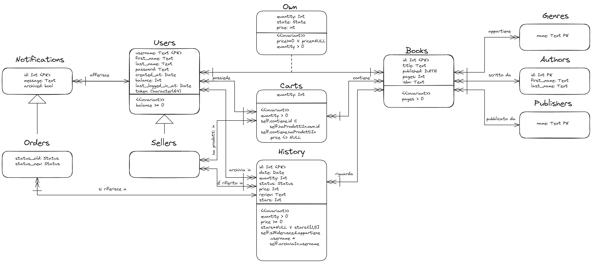

# Tabella dei Contenuti
1. [Introduzione](#introduzione)
2. [Funzionalità Principali](#funzionalità-principali)
3. [Progettazione Concettuale e Logica](#progettazione-concettuale-e-logica)
4. [Query Principali](#query-principali)
5. [Scelte Progettuali](#scelte-progettuali)
6. [Ulteriori informazioni](#ulteriori-informazioni)
7. [Contributo al Progetto](#contributo-al-progetto)

# Introduzione
La variante del progetto da noi scelta è quella dell'"e-commerce", che abbiamo personalizzato come una piattaforma specializzata nella vendita di libri. Questa piattaforma supporta la ricerca delle singole opere, affinabile tramite filtri, e la conseguente acquisto da parte degli utenti registrati. Ogni utente può successivamente decidere di vendere i propri libri al prezzo desiderato e, se l'opera non è ancora presente nel database, può aggiungerla fornendo i relativi metadata, come il genere, l'autore, la copertina, ecc.

# Funzionalità principali
## Sistema di Autenticazione
## Visualizzazione singolo Libro e relative Inserzioni
## Gestione del Carrello
## Visualizzazione degli Acquisti
## Struttura delle Pagine
## Gestione delle Inserzioni
## Visualizzazione della propria Libreria
## Visualizzazione delle Notifiche
## Gestione degli Ordini
## Gestione del Profilo
## Gestione della Ricerca
## Visualizzazione Venditore

# Progettazione Concettuale e Logica

Progettazione Concettuale e Logica della basi di dati opportunamente spiegate e motivate La presentazione deve seguire la notazione grafica introdotta nel Modulo 1 del corso.

# Query Principali
una descrizione di una selezione delle query più interessanti che sono state implementate all’interno dell’applicazione, utilizzando una sintassi SQL opportuna.

# Scelte Progettuali
politiche di integrità e come sono state garantite in pratica (es. trigger), definizione di ruoli e politiche di autorizzazione, uso di indici, ecc. Tutte le principali scelte progettuali devono essere opportunamente commentate e motivate.

# Ulteriori informazioni
scelte tecnologiche specifiche (es. librerie usate) e qualsiasi altra informazione sia necessaria per apprezzare il progetto.

# Contributo al progetto
una spiegazione di come i diversi membri del gruppo hanno contribuito al design ed allo sviluppo.
